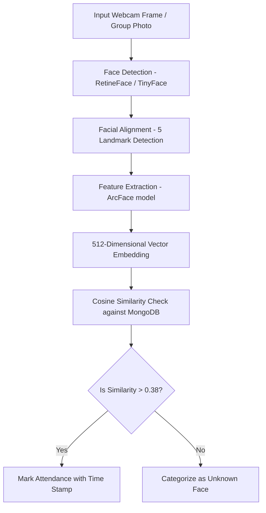

# Team Name: Bug Busters

🏆 **Hackathon Submission**
- **Primary Track:** Promtal
- **Also Fits:** Saasum AI
- **Problem Statement:** Employee & Student Attendance with Consent-Based Facial Recognition

---

## 💡 Project Overview
SMILE (Smart Multi-Image Log Engine) is a privacy-first, zero-friction, consent-based facial recognition attendance system designed for modern campuses and workplaces. By leveraging high-accuracy deep learning pipelines and segregated data storage, SMILE eliminates proxy attendance, saves valuable class time, and ensures strict privacy compliance.

### 🔒 Privacy & Consent at the Core
Unlike invasive surveillance systems, SMILE is built on a **consent-first protocol**:
- **Opt-in Registration:** Face templates are generated only when students or employees explicitly upload a reference image for registration.
- **Mathematical Hashes Only:** Raw images are discarded or kept strictly in secure GridFS storage; only anonymized **512-Dimensional feature vectors** (embeddings) are stored in the database for matching.
- **Bilateral Access Control:** Secure JWT authentication restricts access to registered faculties and HODs, completely isolating individual user records.

---

## 🎯 MVP Scope & Core Features

### 1. Zero-Friction Registration
Employees or students can register their profiles with a single reference photograph. The backend automatically extracts facial landmarks and registers the mathematical identity in the database.

### 2. Multi-Mode Attendance Scan
* **Live Webcam Scan:** A dynamic scanner capturing camera frames and instantly analyzing individual faces in a matter of seconds.
* **Batch Photo Processing (Group Recognition):** Upload group photos (e.g. classroom snapshots, team huddles) to mark attendance for dozens of individuals in one single step.

### 3. Dynamic Schedule Selector & Nav Fallbacks
Features a dynamic, responsive classroom timetable dashboard and class selector fallbacks. Faculties can easily select pre-populated weekly sessions or manually initialize attendance for extra hours on the fly.

### 4. Interactive Attendance logs & Automated Reports
* **Live Checklists:** Present and Absent student lists dynamically update in real-time, showing check-in precise timestamps.
* **Excel Reports:** Generates Excel spreadsheets automatically separated into *Present* and *Absent* worksheets, fully tagged with course, class, time slot, and teacher metadata.

---

## 🛠️ The Tech Stack

```
   [React 18 Frontend]  <--- (Axios/REST APIs) --->  [Flask Backend]
            |                                               |
   (Bootstrap 5 Styling)                         (InsightFace AI / ArcFace)
            |                                               |
  (React Webcam Streams)                         (MongoDB Atlas & GridFS)
```

### **Frontend**
- **Framework & Routing:** React (v18.3.1), React Router DOM (v7.11.0)
- **Styling:** Bootstrap 5.3.8 & Modern Glassmorphism CSS
- **Integrations:** React Webcam (v7.2.0) for real-time camera capture, Axios for API calls

### **Backend**
- **Framework:** Python Flask
- **AI/ML Engine:** **InsightFace** utilizing the industry-leading **ArcFace (buffalo_l)** model for high-accuracy alignment and feature extraction.
- **Image Manipulation:** OpenCV & NumPy
- **Document Generation:** OpenPyXL for automated, styled Excel worksheets

### **Database & Storage**
- **NoSQL Databases:** MongoDB Atlas (Dual-segregated database layers for Teacher Authentication and Student/Attendance Records).
- **File Archival:** GridFS (MongoDB) for binary storage of generated reports and uploads.

---

## 🧠 The AI Pipeline & Secret Sauce

SMILE uses a state-of-the-art deep learning pipeline for matching identity under varying illumination and angles:



* **512D Vector Embeddings:** ArcFace maps faces into a hyperspace where distance represents visual identity similarity.
* **Dynamic Cosine Similarity:** Real-time checking uses a strictly-tuned threshold of `0.38` cosine similarity, maximizing recognition accuracy and minimizing false-positives.

---

## ⚡ Quick Start

### 1. Backend Setup
1. Navigate to the backend folder:
   ```bash
   cd backend
   ```
2. Create and activate a virtual environment:
   ```bash
   python -m venv .venv
   .venv\Scripts\activate
   ```
3. Install dependencies:
   ```bash
   pip install -r requirements.txt
   ```
4. Run the development server:
   ```bash
   python app.py
   ```
   *(Running on `http://localhost:5050`)*

### 2. Frontend Setup
1. Navigate to the frontend folder:
   ```bash
   cd frontend
   ```
2. Install packages:
   ```bash
   npm install
   ```
3. Start the application:
   ```bash
   npm start
   ```
   *(Running on `http://localhost:3000`)*

---

## 🚀 Why our Project is a winning one!
1. **Production-Ready UI:** Clean, responsive, dark-mode design system with premium aesthetics, animations, and intuitive layouts.
2. **Dual-Path Scanning:** Fully covers both live face detection (instant checkout) and static image scanning (efficient batch tracking).
3. **No Database Flooding:** Instead of storing high-definition images, the database holds lightweight float arrays, making it incredibly fast and infinitely scalable.
4. **Complete Offline Fallbacks:** Designed with dynamic selector state machines so the system never breaks, regardless of how the teacher navigates through the platform.
